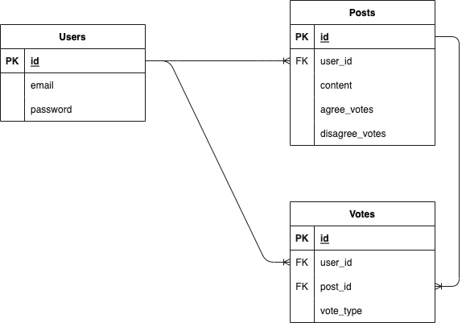

nextjsに触るために、簡単なアプリを作りました。バックエンドはRuby on RailsのAPIモードで開発していて、別のレポジトリとしてpush済みです。いかにそのリンクを貼っておきます。

[バックエンド側のレポジトリ](https://github.com/kousei1015/votes_app_rails_api)

アプリを簡単に説明すると投票アプリです。以下はER図です。

このアプリは、Next.jsにチャレンジしたいと思い、作ってみたものです。ちなみにSSGではなく、SSRで開発しました。

1. まず、ユーザーが何かしらの問いかけ(この問いかけはPostモデルのcontentカラムにあたリます)を投稿します。

2. 次に、ユーザーはその問いかけに対し、賛成か反対かを投稿一覧ページの各投稿にある「賛成する」ボタン、あるいは「反対する」ボタンを押すことで選びます。いずれかのボタンが押された際、user_idとpost_id、votes_typeをPOSTリクエストで送っているということです。ちなみに、votes_typeとはboolean型のカラムで、賛成だったらtrue, 反対だったらfalseだと処理されます。

3. Rails側のactive recordで各投稿の問いかけに対して賛成か、反対かを示す数を表示させています(agree_votes, disagree_votesのこと)。

4. これらの一連の行動によりあるユーザーが投稿した問いかけに対して賛成、反対どちらが多数派かがわかるというアプリになっています。

ちなみに、同じユーザーが同一の投稿に対し、複数回POSTリクエストができないようになっています。つまり、一人のユーザーは一つの投稿の問いかけに対して賛成か反対かを一回しか選べないようになっているということです。もし一人のユーザーが何十回、何百回も投票できてしまったらどちらが多数派かどうかがわからなくなってしまうので。

